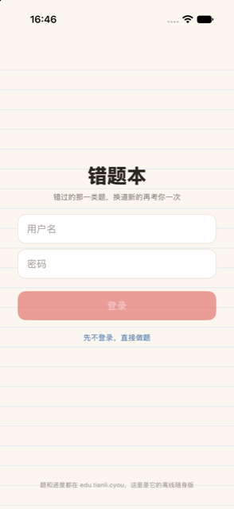
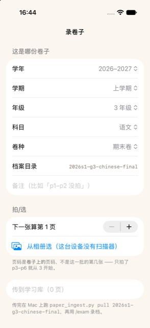

<p align="center"></p>

# 错题本 · wrong-book

**错过的那一类题，换道新题再考你一次——蒙对不算会。**

    

「为了防止记住答案，错的题目也要变下」——错题本记的是题型不是原题，数据结构里没有答案字段，「重放原题」这条路在结构上就不存在。连对两次才划掉。录卷子用的是系统文档扫描器：卷子是文档不是风景，自动找边去透视，一页一页传回学习库自动读错题入库。

<table><tr>
<td align="center" width="25%"><br><sub>开屏一句话就是产品观：错过的那一类题，换道新的再考你一次</sub></td>
<td align="center" width="25%"><br><sub>做题：正确率、连对、今日任务、积分同屏；每道题可一键收进错题本</sub></td>
<td align="center" width="25%"><br><sub>学习路径：语文数学按站推进，重点/基础/挑战分层</sub></td>
<td align="center" width="25%"><br><sub>录卷子：整份卷子逐页扫描传回学习库，服务端自动读错题入库</sub></td>
</tr></table>

## 它做什么

| 功能 | 说明 |
|---|---|
| **错题不重放原题，换道新的再考** | 「为了防止记住答案，错的题目也要变下」——错题本记的是题型不是原题，数据结构里压根没有答案字段，想重放也放不出来。连对两次才划掉。 |
| **整个练习引擎装在包里，离线可做** | 判题、组卷、勋章全是网页版那份引擎原样打包，飞机上照样做题。app 不重写一行判题逻辑——重写一份就是第二个判官，和题库必然漂移。 |
| **录卷子用系统文档扫描器** | 卷子是文档不是风景：自动找边、去透视、多页、排序。一页一页传回学习库，服务端自动读出错题逐道入库——和网页传图走同一条链，不做第二条通路。 |

## 怎么拿到

TestFlight 内测中，暂未开放公开链接。

练习引擎与题库来自作者的 `~/Edu` 内容库（构建时同步进包），账本后端 `edu.tianli.cyou`。没有那份内容库，构建会停在 preBuildScripts。

## 构建

```bash
brew install xcodegen
xcodegen generate
xcodebuild -scheme WrongBook -destination 'generic/platform=iOS Simulator' build
```

- 仓里的 `*.sh` 是作者本机舰队脚本的 shim（三平台构建 / 真机装机 / TestFlight），依赖 `~/Dev` 下的总部工具，不在本仓；没有那套工具时它们会明确退出。
- `Shared/PlatformCompat.swift` 是总部共享文件的逐字节副本（iOS-only SwiftUI 修饰符在 macOS 侧的同名 no-op），别在这里改它。
- `project.yml` 的 preBuildScripts 会跑 `sync-lessons.sh`，从作者本机同步内容进包；没有那份内容时构建会停在这一步。

开发细节（回归、验证通道、约束）见 [DEVELOPING.md](DEVELOPING.md)。

## 相关

- 产品页：<https://apps.tianli.cyou/p/wrong-book-ios.html>
- 舰队总览（10 个 app 怎么来的）：<https://apps.tianli.cyou/ios.html>
- 教程：[从零到 TestFlight：一个人做 iPhone app 的完整路径](https://blog-ai.tianli.cyou/nine-ios-apps-in-two-weeks)

## License

MIT © 2026 曾田力 (Tianli Zeng)
